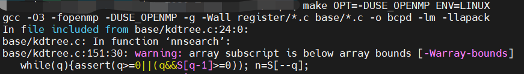
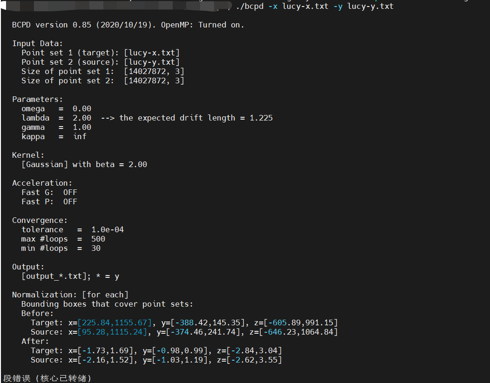

Sorry, I'm a C++ newbie and didn't notice the compiled executable.
And recently i find the bcpd(compiled executable) in the top directory of the uncompressed folder.


I used the following command to install

```
 make OPT=-DUSE_OPENMP ENV=LINUX
```



when i run the following command

```
./bcpd -x lucy-x.txt -y lucy-y.txt
```



The last line reports: Segment error (core dumped)
